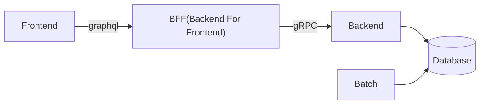
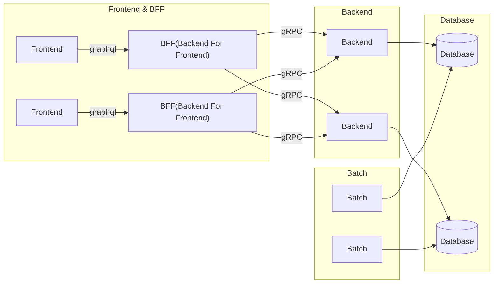
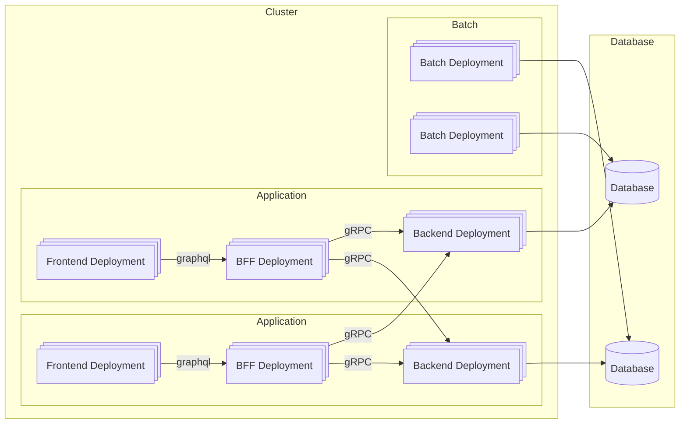

# Explanation of the Application Architecture

## The basic architecture of my application I would like to build is as follows:

## Technologies to be used (still under review)

| Application Type | Framework | 
| --- | --- | 
| Frontend | Next.js(Version: 15.x, Using App Router) | 
| BFF(Frontend For Backend) | Nest.js(10 or 11), graphql |
| Backend | Nest.js(10 or 11), gRPC |
| Batch | Spring boot(3.4.1, Quartz or another) |
| PostgreSQL | 16 |
| MongoDB | 8.0 |
| Kafka | for kafka CDC(debezium/kafka:3.0.0.Final) |
| connect | for kafka CDC(debezium/connect:3.0.0.Final) |
| zookeeper | for kafka CDC(debezium/zookeeper:3.0.0.Final) |

- The reason I chose Nest.js over Spring Boot for the backend is as follows
    - (While I am more familiar with Spring Boot)
    1. learn new technologies
    1. to use gRPC(faster then REST API)

- Also considering whether to use Airflow for Batch Application.

## MSA(Microservice Architecture) is applied, the application architecture will look as follows:

## In the Kubernetes environment, it will be executed as shown below:

- For clarity, only the application itself is represented, excluding Service, Ingress, egress, etc.

- I will make every effort to cover everything from database design to application development. 

- Furthermore, I am diligently studying English. 
